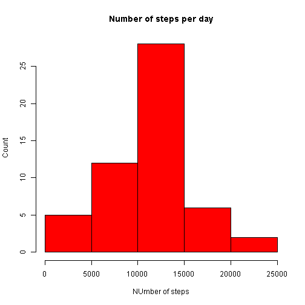
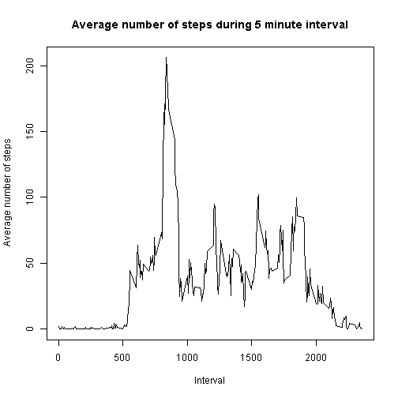
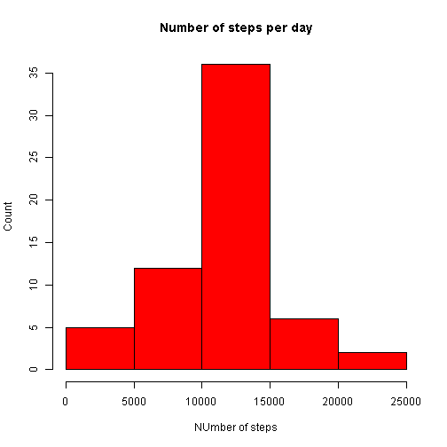

## Loading required libraries

```r
library(Hmisc)
```

```
## Warning: package 'Hmisc' was built under R version 3.3.3
```

```
## Loading required package: lattice
```

```
## Warning: package 'lattice' was built under R version 3.3.3
```

```
## Loading required package: survival
```

```
## Warning: package 'survival' was built under R version 3.3.3
```

```
## Loading required package: Formula
```

```
## Loading required package: ggplot2
```

```
## Warning: package 'ggplot2' was built under R version 3.3.3
```

```
## 
## Attaching package: 'Hmisc'
```

```
## The following objects are masked from 'package:base':
## 
##     format.pval, round.POSIXt, trunc.POSIXt, units
```

```r
library(png)
library(lattice)
```

## Reading and preprocessing the data

**1. Load the data from csv file**

```r
fileUrl<-"C:/DS/C5/activity.csv"
activitydata<-read.csv(fileUrl)
```

**2. Skip NA values and format the date**


```r
data<-na.omit(activitydata)
data$date <- as.Date(data$date)
```

## What is mean total number of steps taken per day?


```r
totalsteps<-summarize(data$steps, by = data$date, FUN = sum)
```

###Make a histogram of the total number of steps taken each day

**Rename the columns of resulting data frame**

```r
colnames<-c("Date", "Steps")
colnames(totalsteps)<-colnames
```


```r
hist(totalsteps$Steps, col="red", xlab = "NUmber of steps", ylab = "Count", main = "Number of steps per day")
```



###Calculate and report the mean and median of the total number of steps taken per day


```r
StepsMean<-mean(totalsteps$Steps)
StepsMedian<-median(totalsteps$Steps)
print(StepsMean)
```

```
## [1] 10766.19
```

```r
print(StepsMedian)
```

```
## data$steps 
## 2012-11-12 
##      10765
```

##What is the average daily activity pattern?
**Make a time series plot (i.e. type = "l") of the 5-minute interval (x-axis) and the average number of steps taken, averaged across all days (y-axis)**


```r
intervalavg<-summarize(data$steps, by = data$interval, FUN = mean)
colnames<-c("Interval", "Steps")
colnames(intervalavg)<-colnames
```

**create a time series plot of the 5-minute interval (x-axis) and the average number of steps taken, averaged across all days (y-axis)

```r
plot(intervalavg$Interval, intervalavg$Steps, 
      type="l",
      xlab="Interval",
      ylab="Average number of steps",
      main="Average number of steps during 5 minute interval")
```



**Which 5-minute interval, on average across all the days in the dataset, contains the maximum number of steps?

```r
index<-which.max(intervalavg$Steps)
max<-intervalavg[index,2]
print(max)
```

```
## data$steps 
##      835 
## 206.1698
```

##Imputing missing values

**1. Calculate and report the total number of missing values in a data set


```r
missing<-sum(!complete.cases(activitydata))
```
Number of missing values: 

```r
print(missing)
```

```
## [1] 2304
```

**2. Devise a strategy for filling in all of the missing values in the dataset.**
**3. Create a new dataset that is equal to the original dataset but with the missing data filled in.**

```r
fillmissing<-activitydata
for (i in 1:nrow(fillmissing))
{
        if (is.na(fillmissing$steps[i]))
        {
                idx <- which(fillmissing$interval[i] == intervalavg$Interval)
                fillmissing$steps[i] <- intervalavg$Steps[idx]
        }
}
```

**Make a histogram of the total number of steps taken each day and Calculate and report the mean and median total number of steps taken per day**

```r
#summarize the result by date
fillmissing$date<-as.Date(fillmissing$date)
totalstepsnona<-summarize(fillmissing$steps, by = fillmissing$date, FUN = sum)
colnames(totalstepsnona)<-c("Date", "Steps")

#make a histogram
hist(totalstepsnona$Steps, col="red", xlab = "NUmber of steps", ylab = "Count", main = "Number of steps per day")
```




**Calculate and report the mean and median total number of steps taken per day**

```r
MeanTotal<-mean(totalstepsnona$Steps)
MedianTotal<-median(totalstepsnona$Steps)
print(MeanTotal)
```

```
## [1] 10766.19
```

```r
print(MedianTotal)
```

```
## fillmissing$steps 
## 2012-11-04 
##   10766.19
```

##Are there differences in activity patterns between weekdays and weekends?

**add factor variable weekday


```r
week<-c("Monday", "Tuesday", "Wednesday", "Thursday", "Friday")

for (i in 1:nrow(fillmissing))
{
        if (is.element
            (weekdays (as.Date(fillmissing$date[i])), week))
        {
                fillmissing$dw[i] <- "weekday"   
        } else {
                fillmissing$dw[i] <- "weekend"
        }
}
```

**Make a panel plot containing a time series plot (i.e. type = "l") of the 5-minute interval (x-axis) and the average number of steps taken, averaged across all weekday days or weekend days (y-axis).**


```r
averageperint<-aggregate(steps~interval + dw, data =fillmissing, mean )
xyplot(steps~interval | dw, averageperint, type = "l", layout = c(1,2), xlab = "Interval", ylab = "Number of steps")
```


